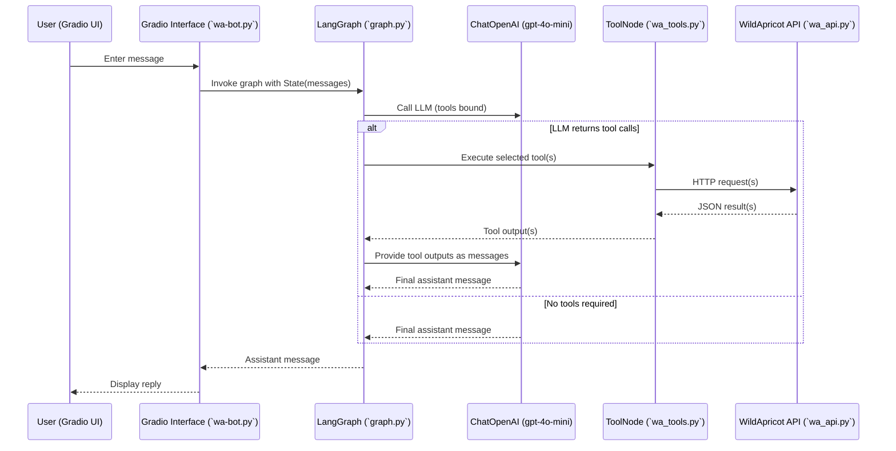
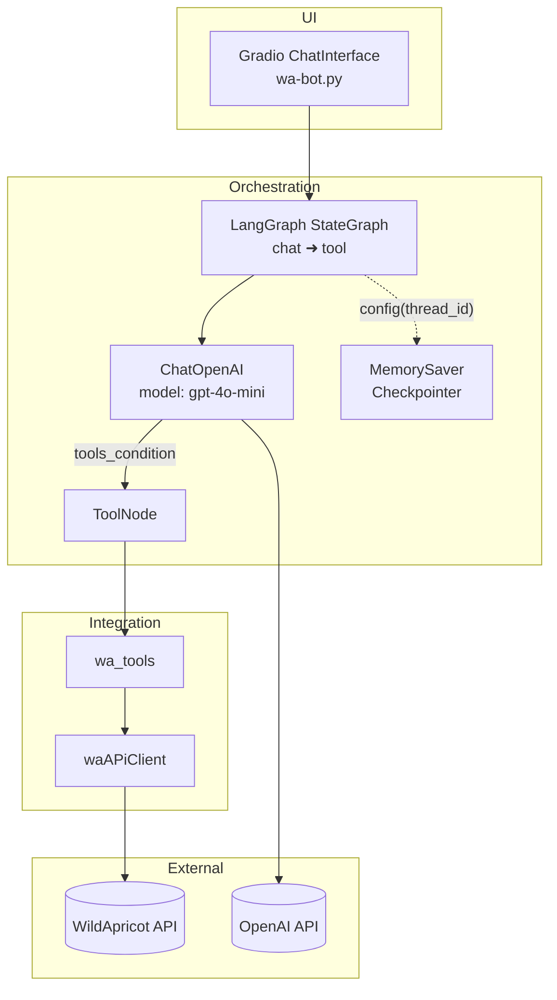
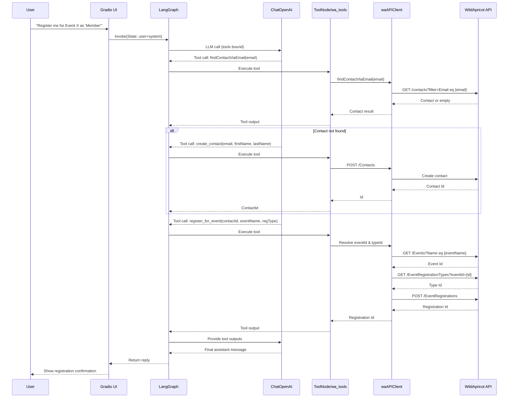
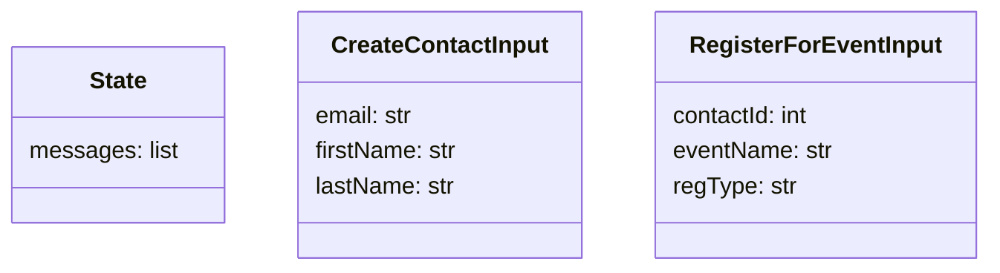

## Architecture Overview

This document describes the architecture and runtime behavior of the WA Chat Agent. It covers components, data flow, tools, and external integrations.

### High-Level Architecture (Tech)

```mermaid
graph TB
    %% Layers
    subgraph Client[Client]
        U[User Browser]
    end

    subgraph Host[App Host (VM or Container)]
        G[Gradio Web App\nPython 3.12]
        LG[LangGraph Orchestrator\nChatOpenAI + ToolNode]
        WT[wa_tools\nTool wrappers]
        WAC[waAPiClient\nOAuth2 Client Credentials]
        MEM[MemorySaver\nIn-memory checkpoints]
        ENV[.env / Secrets]
        LOG[App Logs]
    end

    subgraph Ext[External Services]
        OPENAI[(OpenAI API)]
        WA[(WildApricot API)]
        OA[(WildApricot OAuth Token)]
    end

    %% Flows
    U -->|HTTPS| G
    G --> LG
    LG -->|LLM calls| OPENAI
    LG --> WT
    WT --> WAC
    WAC -->|Token| OA
    WAC -->|REST| WA

    %% Support
    LG -.state.- MEM
    G -.reads.- ENV
    WAC -.reads.- ENV
    G --> LOG
    LG --> LOG
    WAC --> LOG
```

### Components

- **UI**: `wa-bot.py`
  - Gradio `ChatInterface` providing a web chat UI.
  - Builds the graph with `GraphBuilder` and `MemorySaver` checkpointer.
  - Defines a system prompt for the assistant persona and invokes the graph on each user message.

- **Orchestration**: `graph.py`
  - Constructs a `StateGraph` with two nodes: `chat` (LLM) and `tool` (LangGraph `ToolNode`).
  - Binds tools from `wa_tools` to `ChatOpenAI` (model: `gpt-4o-mini`).
  - Conditional routing via `tools_condition`: if the LLM decides to call tools, execution goes to the `tool` node; otherwise, the conversation ends.
  - Thread-scoped memory via `MemorySaver` and a generated `thread_id` in `configurable`.
  - Recursion limit set to 10 to avoid infinite loops.

- **Tools**: `wa_tools.py`
  - Declares tool wrappers around `waAPiClient`:
    - `list_contacts`
    - `findContactViaEmail`
    - `list_events`
    - `create_contact` (StructuredTool, validated by `CreateContactInput`)
    - `get_event_registrations`
    - `register_for_event` (StructuredTool, validated by `RegisterForEventInput`)

- **WA API Client**: `wa_api.py`
  - Handles OAuth token retrieval and authenticated requests to WildApricot.
  - Provides methods for events, contacts, contact creation, event registration, and fetching registrations.
  - Uses environment variables `WA_API_KEY` and `WA_ACCOUNT_ID`.

- **State Model**: `state.py`
  - Pydantic `State` with `messages` aggregated via `add_messages` for LangGraph compatibility.

- **Tool Input Schemas**: `inputModels.py`
  - `CreateContactInput` and `RegisterForEventInput` pydantic models used by StructuredTools.

### Runtime Flow

1. User types a message in the Gradio UI (`wa-bot.py`).
2. The app builds a `State` containing user and system messages and invokes the graph.
3. The `chat` node calls `ChatOpenAI` (tools bound). The model may decide to call tools.
4. If tools are requested, control routes to `ToolNode`, which executes the selected tool(s) from `wa_tools`.
5. Tool functions call `wa_api` methods, which make HTTP requests to WildApricot.
6. Results are returned to the LLM for final response generation.
7. The final assistant message is returned to the UI and displayed to the user.

### Sequence Diagram



### Component Diagram



### Functional Capabilities

- **Contacts**:
  - `list_contacts`: Fetch contacts (paginated).
  - `findContactViaEmail`: Search by email.
  - `create_contact`: Create a new contact (requires `email`, `firstName`, `lastName`).

- **Events**:
  - `list_events`: Fetch available events.
  - `get_event_registrations`: Get registrations for a named event.
  - `register_for_event`: Register a contact by `contactId` to an event `eventName` with `regType`.

### Configuration and Environment

- **OpenAI**: `OPENAI_API_KEY` used implicitly by `ChatOpenAI`.
- **WildApricot**: `WA_API_KEY`, `WA_ACCOUNT_ID` required by `wa_api`.
- **dotenv**: `.env` is loaded at startup by `wa-bot.py` and `wa_api.py`.

### Error Handling and Safeguards

- `require_token` decorator ensures a valid OAuth token before API calls; `getToken` fetches and caches the token.
- API methods propagate `requests` errors as safe messages or error dicts in some cases (e.g., `create_contact`) to avoid retries.
- Graph recursion is capped (`recursion_limit=10`).
- Deletions are intentionally unsupported per system prompt guidance.

### State and Memory

- `State` holds `messages` with `add_messages` aggregation for turn-by-turn accumulation.
- `MemorySaver` checkpointing persists conversation state keyed by a generated `thread_id` for each session.

### Notes

- Tool routing relies on `tools_condition` from LangGraph to branch between direct LLM responses and tool execution.
- When registering for events by email, the agent should first try `findContactViaEmail`; if not found, create the contact and then register.

### Additional Diagrams

#### Deployment Diagram

```mermaid
graph TD
    U[User Browser] -->|HTTPS| GWA[Gradio Web App\nwa-bot.py]
    subgraph Host Machine
        GWA --> LG[LangGraph Orchestrator\nchat/tool nodes]
        LG --> MS[MemorySaver\nThread Checkpoints]
        LG --> TOOLS[wa_tools]
        TOOLS --> WAC[waAPiClient]
        GWA -.env vars.-> ENV[.env (OPENAI_API_KEY, WA_API_KEY, WA_ACCOUNT_ID)]
    end
    LG -->|API| OPENAI[(OpenAI API)]
    WAC -->|API| WA[(WildApricot API)]
```

#### Detailed Registration Sequence



#### Data Model Overview




